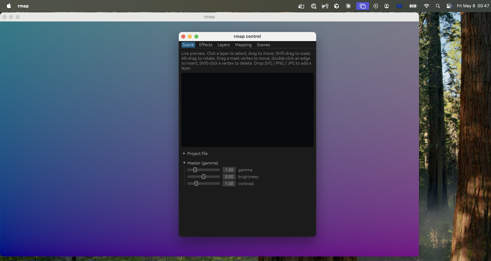
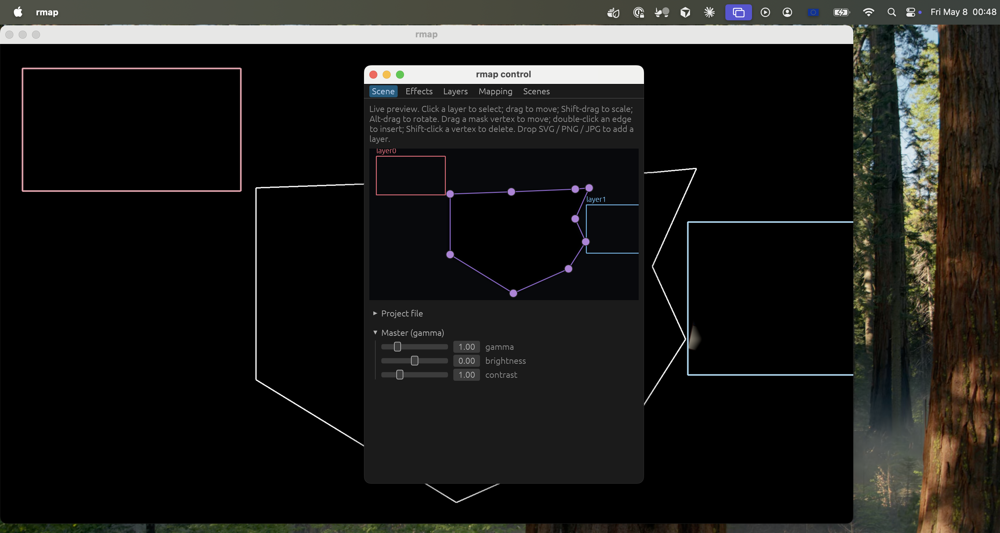
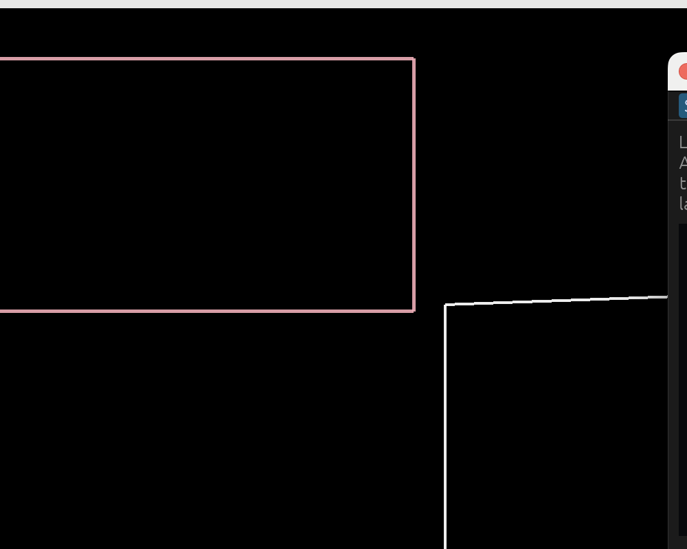
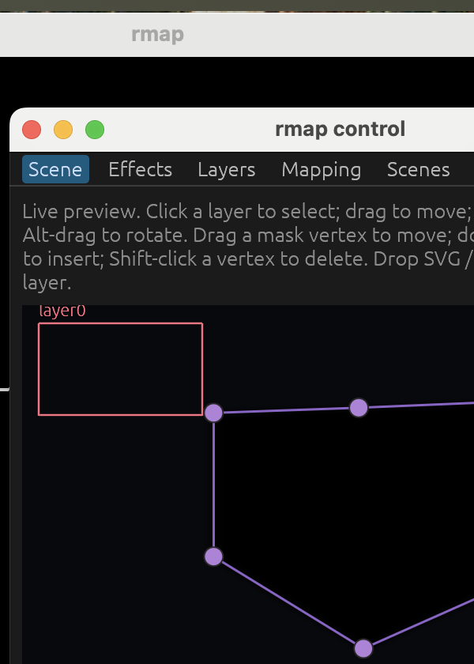

# Spec 003 — UI/UX Overhaul: make rmap feel obvious

> Successor to `specs/002-direct-scene-editor.md`. v2 turned the control
> window into a direct-manipulation editor; v3 turns the *whole product*
> into something a non-technical operator can pick up cold and feel "I
> know what to do" within five seconds.
>
> This is a UX spec. It does not reverse architecture decisions made in
> v1/v2. It restructures the surface area, the language, the defaults,
> and the first-run experience.

## Visual evidence (running app, May 2026)

The audit was grounded in screenshots of the actual running binary
(`target/release/rmap` invoked with and without a saved project,
windowed on the primary display so both windows are visible). Five
captures live in `specs/screenshots/`. The most damning are
referenced inline below.

### What a first-time user sees on launch with no project



Both windows visible:

- **Output window** (background, fills most of screen, title bar:
  `rmap`). The desktop wallpaper *bleeds through* — the renderer
  hasn't drawn anything yet because there are no layers, so the
  user is greeted with a translucent / unrendered surface. There
  is no "blank canvas" affordance, no "drop content here", no test
  pattern, no project name, no instruction. A first-time user
  cannot tell whether the projector is working.
- **Control window** (foreground, small, title bar: `rmap control`).
  Five tabs squeezed into a 420pt-wide window. **The first thing
  the user reads is a 5-sentence wall of mouse-gesture
  instructions** for actions they cannot yet perform — "Click a
  layer to select; drag to move; Shift-drag to scale; Alt-drag to
  rotate. Drag a mask vertex to move; double-click an edge to
  insert; Shift-click a vertex to delete. Drop SVG / PNG / JPG to
  add a layer." Below that: a **black rectangle** (empty live
  preview) and three sliders for **gamma / brightness / contrast**
  expanded by default — engineering-grade dials presented as if
  they were the primary controls.

### What the user sees when they open a saved project



This screenshot is the truest indictment of the current UX. The
saved project loads successfully — the renderer is running, the
SVG is read, the warp grid is configured, the masks are painted.
But on the projector window we see:

- A pink rectangle outline (layer 0's editor-overlay bounding box).
- A blue rectangle outline (another layer's overlay).
- White-ish polygon outlines (mask zones, warped through the
  homography).
- **No actual image content. Anywhere.**



Why? The saved project happens to have `transform.scale = [0.0,
0.0]` for its layers (a JSON serialisation quirk — the schema
default appears to write zero rather than identity scale into the
file). The content collapses to zero size. The user sees only the
editor overlays — outlines drawn *because* the user hasn't
disabled the overlay (`O` key) — and cannot tell that:

1. Their content is not actually projected.
2. The outlines they are seeing are debugging chrome, not content.
3. There is a single project value (`scale`) that, if changed from
   `[0, 0]` to `[1, 1]`, would make their photo appear.

There is no warning, no hint, no "your layer is invisible at this
scale" yellow banner. This is exactly the failure mode a beginner
will fall into and silently give up on.

### What the control window's Scene tab looks like in detail



Up close:

- **Five tabs** — Scene, Effects, Layers, Mapping, Scenes — packed
  into ~420pt of horizontal space.
- **The "rmap control" title bar is two windows above the actual
  app's title bar** ("rmap" output window). Both windows are named
  "rmap"; users have to learn which is which.
- The **dense help text** is the very first content. Five sentences
  of mouse-gesture instructions before any image is loaded.
- The live preview is a black rectangle with a small layer-bounds
  outline (red, top-left) and mask-vertex handles (purple dots).
  An operator who has never used rmap before would not be able to
  tell those purple dots are "draggable mask polygon vertices".

### What this evidence adds to the audit

The screenshots confirm and sharpen the criticisms below:

- The empty state is **not just unguided** — it shows the desktop
  wallpaper through the projector window. It does not look like an
  app at all; it looks broken.
- The loaded state can produce **zero rendered content with no
  feedback**. A saved project can be silently invisible. (See
  Section L below — "L. Failure mode caught during the audit".)
- "Live preview" gestures are **explained before content exists**,
  inverting progressive disclosure: the user reads instructions
  for actions they cannot perform.
- "Master (gamma)" defaulting open is **the loudest control on
  screen** for a beginner who has never heard the word *gamma*.

---

## Why this exists

Today rmap is technically capable but emotionally intimidating.

A first-time user opens the app and meets:

- A CLI gate (`--monitor`, `--windowed`/`--fullscreen`, `--autostart`,
  optional `*.rmap.json` argument) before the first pixel ever renders.
- A 420×600 control window split across **five tabs** of roughly equal
  visual weight (Scene, Effects, Layers, Mapping, Scenes), plus two
  always-visible collapsibles (Project file, Master / gamma).
- A "Layers" tab whose primary action is **typing an absolute SVG file
  path** into a text field.
- A "Mapping" tab with a 480×270 *checker-pattern placeholder* labelled
  "output area (placeholder thumbnail)" — i.e. the surface the user
  warps doesn't actually show what they're warping.
- Vocabulary lifted directly from the rendering pipeline: *warp*, *mesh*,
  *mask polygon*, *modulator*, *source rect*, *blend mode*, *gamma*,
  *crossfade*, *external pass*.
- A "Master (gamma)" section open by default, third-from-top in the
  layout — engineering's most expert dial, presented as if it were a
  beginner's tool.

The product is not missing features. It is missing **a story the user
walks through.** This spec defines that story.

---

## A. Executive assessment

The ten things that most prevent the "I know what to do" reaction:

1. **Launch is a terminal command.** A beginner must hold three flag
   decisions in their head before seeing UI. Until rmap launches like
   a normal Mac app, nothing else in this spec rescues first impression.
2. **Five flat tabs of equal weight.** Scene, Effects, Layers, Mapping,
   Scenes do not communicate sequence. Nothing tells the user where
   to start.
3. **"Add layer" is a typed file path.** Drag-and-drop exists but is
   only hinted in tiny grey text inside the Scene tab. The obvious
   gesture (drop a JPG anywhere) and the obvious affordance (a big
   "+ Add image" button with a file picker) are both missing.
4. **Mapping is divorced from the thing being mapped.** The Mapping tab
   shows a checker placeholder, not the live preview. Users are asked
   to drag corners on an abstract grid while the actual image lives in
   another tab. The two should be one surface.
5. **Always-visible expert dials.** Master gamma/brightness/contrast and
   per-layer modulator pickers (sine/triangle/noise/bpm/audio) are
   exposed at the same level as "move this image". Progressive
   disclosure is absent.
6. **Advanced concepts surface too early.** Gamma sliders, modulator
   types, blend modes, and source-rect editing greet a first-time
   user before they've placed a single image. The right answer is
   *progressive disclosure*, not renaming — the terminology stays,
   but advanced controls only appear when the user has earned them.
7. **The output window is invisible until you map.** A new user has no
   way to verify "is this thing actually projecting?" without reading
   the README about the `B`/`F`/`T`/`O` keyboard shortcuts.
8. **No empty state.** With no project loaded, the Scene tab shows
   "(scene preview not yet registered — output window not initialized)".
   That is a developer log line shown to the user.
9. **Project save is a typed `.rmap.json` filename.** No "Save", no
   "Save As…", no recent projects. The user has to know the file
   extension to save.
10. **No "first success" moment.** There is no template, no demo
    project, no two-click path to *seeing something projected*. A
    creative tool that doesn't immediately reward you with a pretty
    image on a wall has not done its job.

The biggest opportunity in five bullets:

- **Replace the CLI front door with a project picker window.** Every
  technical decision the CLI asks for (monitor, windowed/fullscreen,
  project file) has a better answer as a visual choice.
- **Collapse Scene + Mapping + Layers into one canvas.** One visual
  surface where the user sees their content, drops new content, and
  drags corners to fit it to the wall.
- **Hide everything advanced behind a single "Advanced" disclosure.**
  Modulators, gamma, blend modes, source rects, external passes,
  crossfade-only-when-topology-matches behaviour — all live there.
- **Ship a 60-second guided first run.** Pick projector → drag in an
  image → drag the corners → done. Three steps, zero typed paths.
- **Explain the vocabulary in context, do not rename it.** Warp,
  mask polygon, modulator, gamma, blend mode all stay — they are
  the terms an operator must learn to use rmap effectively. What
  changes is *when* the user meets them and *how*: a small "?"
  next to each advanced label opens a one-line plain-English
  explanation, and labels never appear on the default surface
  before the user actually needs them.

---

## B. First-use friction audit

Every reason a new user hesitates, in order of when they hit it.

| When | Friction | Severity |
|------|----------|----------|
| Before launch | Has to use a terminal at all | Blocking |
| Before launch | Has to pick `--monitor INDEX` without knowing what index means which projector | Blocking |
| Before launch | Has to choose `--windowed` vs `--fullscreen` with no preview | High |
| Before launch | Has to know that `--list-monitors` exists | High |
| First frame | Output window is fullscreen and instantly takes over the projector with a blank dark grey | High |
| First frame | Control window is 420×600 in a corner of the primary display, easy to miss | Medium |
| First frame | Five tabs, no indication which tab to start on | High |
| Layers tab | "Add layer" requires typing or pasting a file path | Blocking |
| Layers tab | "Path does not exist." / "File must have extension .svg." error microcopy | Medium |
| Effects tab | "(none — assets/presets/*.json not found)" — visible internal path | Medium |
| Effects tab | Modulator combobox showing sine/tri/noise/bpm/audio next to a hue slider | High |
| Mapping tab | "Coordinates are normalized [0,1]" — math language | Medium |
| Mapping tab | Placeholder checker thumbnail instead of live image | Blocking |
| Mapping tab | "Reset to identity" button — geometry term | Medium |
| Mapping tab | "mesh rows / cols" exposed by default | Medium |
| Scenes tab | Numbered slots 1–9 with no thumbnails | High |
| Scenes tab | "Crossfade only fires when both scenes share the same layer paths in the same order" — three sentences of edge-case explanation | High |
| Project file | "Filename should end with .rmap.json" — implementation leaking | High |
| Project file | "Restart rmap to apply" for the windowed checkbox | High |
| Master | Gamma/brightness/contrast open by default | Medium |
| Anywhere | No undo | Blocking for confidence |
| Anywhere | No "what do the B/F/T/O keys do?" indicator | Medium |
| Anywhere | No way to switch projectors without quitting and relaunching | High |

**The single most damaging friction:** the user cannot get to *"my
photo is projected on the wall and I can drag its corners to fit"*
without reading the README and using a terminal. Every ambition in
this spec assumes that one experience is the floor, not the ceiling.

---

## C. 11-star experience ladder

Imagined first-use of rmap by a non-technical operator (a event
host's friend, a small-event lighting volunteer, a school AV teacher
setting up for a play).

### 1-star — broken
They double-click the app, nothing visible happens, the projector
stays dark. They open Terminal, paste a command from a forum post,
get an error about a monitor index. They give up.

### 3-star — works for experts only
With a README and a colleague's help, they get a fullscreen output
on the projector and a control window with five tabs. They spend
fifteen minutes typing file paths to add an SVG, dragging four
corner handles in a separate tab, and fail to save because they
didn't know the filename had to end in `.rmap.json`. They tell their
friend "this thing is powerful but you need to be a techie."

### 5-star — competent and forgettable (≈ today's ceiling after v2)
They launch. They see five tabs but eventually find the Scene tab
preview, drop a JPG onto it, and drag the image to the wall. The
mapping corners work. They project a simple slideshow successfully.
They finish the gig but couldn't tell you the name of the app the
next morning. **This is roughly where rmap lives once v2 is fully
shipped and a CLI alias hides the flags.**

### 7-star — surprisingly smooth, confidence-building
They double-click the app icon. A welcome window appears with three
options: "Start blank", "Open a recent project", "Try a demo". They
click Demo. The output window opens *windowed* on the projector
showing a demo image with four corner handles already lit up; the
control window says **"1. Drag the corners to match the wall."** They
do. The handles glow as they touch them. The header advances to
**"2. Drop your own photo on the canvas."** They do. Done in 90
seconds. They didn't read documentation, didn't open Terminal,
and didn't have to touch a single Advanced control. The
terminology they *did* encounter — *layer*, *warp*, *scene* —
was each explained in one sentence the first time it appeared,
not buried in a doc somewhere. They feel competent and they have
learned three real words of the craft.

### 9-star — almost magical
The same flow, plus: when they first launch, rmap detects the second
display, names it ("BenQ TH685 — Living Room Wall"), and asks "Is
this your projector? [Yes] [No, pick another]". When they drag a
corner, a faint dotted outline of the *other three* corners predicts
where their next drag will go. When they drop a portrait photo, rmap
suggests the existing fit modes (`cover` / `contain` / `stretch`,
the same ones spec 002 defines on `LayerConfig`) with one-tap
previews. Saving is automatic — every change is a snapshot, named
projects are a *Save As*. The keyboard shortcuts (Blackout, Freeze,
Test pattern, Overlay) live as four large buttons on a "Show day"
strip that only appears when the user clicks **Go live**.

### 11-star — visionary
They open the app on an iPad. They point the iPad's camera at the
wall they want to project on. The app overlays the projector's
output cone in AR, draws a virtual rectangle of the projection area,
and asks "Tap the corners of the wall." Four taps later the warp
is calibrated to within a pixel. Photos drop in via the iPad photo
picker. Lighting fixtures on the same Wi-Fi auto-discover and the
app proposes "Match the wash colour to the photo?" A scene
transition is a swipe between two photos on a film strip. The
operator never types, never reads jargon, never opens a manual. The
product feels like Procreate for projection.

### Realistic target tier

**7-star is the sweet spot.** It is reachable in this spec without
new platforms, new protocols, or AR. It is the tier where users
*tell other people about the app*. 9-star and 11-star are useful as
a north star for individual decisions — "would the 9-star version
expose this slider here?" — but the engineering work to get there
is out of scope for this overhaul.

The remainder of this document is the path from 5-star to 7-star.

---

## D. UX redesign recommendations

Concrete changes, prioritised. "Impact" is on the *first-use
confidence* metric, not on engineering effort.

### High impact

**D1. A real launcher window.** Replace `cargo run -- ...` as the
front door. On launch, show a small window:

- Big buttons: **New show**, **Open recent**, **Try a demo**.
- A projector picker that lists *human names* of attached displays
  ("BenQ TH685", "LG 32GP850") with a tiny live thumbnail of each.
  Selecting a projector previews where the output will appear.
- A "Test pattern on selected projector" button — answers "is the
  cable plugged in?" before any creative decision.
- All CLI flags become defaults the launcher can override. The CLI
  remains for power users, but is no longer the gate.

**D2. Merge Scene + Mapping + Layers into one canvas.** The user's
mental model is "my image, on the wall, fitted to the wall." Three
tabs to do that one thing is the core problem.

The new layout:

- The canvas is the entire control-window center. Always shows the
  live projector output.
- Layers stack on the **left edge** as a vertical strip of thumbnails
  (Procreate-style). Drag a thumbnail to reorder. Drop an image
  anywhere on the canvas to add a layer. A "+" tile at the bottom of
  the strip opens a file picker.
- Warp handles (the mapping grid) are *handles on the canvas
  itself*, toggled by a **Warp** mode button on the toolbar. The
  mesh resolution control disappears from the default surface
  (default 2×2 corner pin; advanced users get rows/cols inside
  Advanced).
- The "selected layer" inspector is a floating right-edge popover
  that only appears when something is selected.

**D3. Single "Advanced" disclosure for power features.** Everything
listed here moves behind one labelled "Advanced" button on the
toolbar (a gear icon, not a tab):

- Modulator types beyond Static (sine, triangle, noise, bpm, audio).
- Master gamma / contrast / per-layer blend mode.
- Source rect editing, mask SDF feather, mesh rows/cols.
- Effect chain editor with multiple effects per layer.
- External-pass `params` JSON.
- Project-file path field, autostart flag, output_windowed flag.
- Keyboard cheat sheet (B/F/T/O, scene recall hotkeys).

The default canvas should fit on a 13" laptop without scrolling.

**D4. Ship three demo projects.** Bundled in `assets/demos/`:

- **"Window glow"** — a portrait photo in a window-rectangle mask,
  with a soft warm wash. event-relevant.
- **"Slow film strip"** — three landscape photos cycling with a 4s
  crossfade. Shows scenes + transitions.
- **"Test grid"** — a calibration target with corner labels. Shows
  warp + mask without needing user assets.

The launcher's "Try a demo" picks one of these. *This is the most
important single change for first-impression confidence.* The
fastest path to "I made something work" is "I made something
*someone else already made* work."

**D5. In-context glossary, not renames.** Every advanced label keeps
its proper name (warp, mask polygon, modulator, gamma, blend mode,
crossfade, source rect) — the operator should *learn* the
vocabulary, because it is the same vocabulary every other
projection-mapping tool uses. What changes is the *context* in
which terms appear:

- Each advanced label gets a small `?` icon. Click → a 1–2
  sentence plain-English explanation appears as a popover, with a
  link to the docs section if the operator wants more.
- Specialised terms never appear on the default canvas. They only
  surface inside the Advanced disclosure, where the operator has
  opted in.
- Where today's UI uses dense paragraphs to explain a single term,
  rewrite to one short sentence per term — see Section H.

The principle: **rmap should *teach* its language, not hide from
it.** A confident user is one who has learned the words, not one
who never encountered them.

**D6. Direct manipulation everywhere or nowhere.** Today some things
are direct (drag a layer in Scene tab) and some are not (drag a
warp corner in Mapping tab, but on a checker placeholder; type a
file path in Layers). Make every authoring action direct, on the
canvas, with the live image visible.

### Medium impact

**D7. Persistent "Show-day strip" along the bottom.** Four buttons,
always visible: **Blackout**, **Freeze**, **Test pattern**,
**Outlines**. They mirror the B/F/T/O keys. A first-time user does
not have to read a doc to know that pressing the big BLACKOUT button
cuts the projector. Today these are keyboard-only.

**D8. Auto-save with named snapshots.** Replace the "type a
.rmap.json filename" save flow with: every change saved
continuously to an autosave file; users hit **Save As…** to give a
project a name; the launcher's "Open recent" lists named projects
with thumbnails. The `.rmap.json` extension stops being something
the user has to know.

**D9. Visual scene picker.** Replace the 1–9 numbered slots with a
horizontal film strip of scene thumbnails. Each thumbnail shows the
last-rendered frame from that scene. Click a thumb to recall, drag
a thumb to a + tile to save current as new scene. The hotkeys
1–9 still work; they're just no longer the only way to interact.

**D10. Drag-drop hints on the canvas.** When the canvas has zero
layers, paint *over* the live preview a softly-pulsing dashed
rectangle with the text "**Drop a photo or SVG here**" centered.
Replace the current empty state (`(scene preview not yet
registered — output window not initialized)`).

**D11. Undo / Redo.** Every operation that mutates `Project` should
push onto an undo stack. Cmd-Z everywhere. This is the single
biggest *confidence* feature: users explore more when they can undo.

**D12. Live monitor names in the launcher.** Use the macOS NSScreen
display name (already pulled in via `objc2-app-kit`) to replace
"monitor index 0/1/2" with the actual hardware name + a 16:9
thumbnail.

### Low impact

**D13. Onboarding hints that decay.** The toolbar shows little
"try this" tooltips for the first three sessions, then they stop
appearing automatically (a "?" button reveals them again).

**D14. Theme polish.** A single calmer dark theme (close to today's
`(8, 9, 12)` background) with one warm accent colour for active
handles. Today's mix of `(180, 160, 70)` mustard handles and
`(120, 165, 220)` blue mesh and `(220, 120, 100)` red error text is
visually noisy.

**D15. iPad-like motion.** Spring-eased drag, a subtle "snap" when
a corner approaches the framebuffer edge, a momentary pulse when
a layer is dropped. Today's interactions are functional but
mechanical.

---

## E. Simplification plan

What to remove, hide, merge, reorder, or automate. (Renames are
*not* on the list — domain terminology stays. See D5.)

### Remove from default surface

- The five-tab strip. Replaced by one canvas.
- The "Project file" collapsible (replaced by autosave + Save As).
- The "Master (gamma)" collapsible (moves to Advanced).
- The "Effects" tab in its current per-layer-effect-chain form
  (replaced by a one-click presets row + Advanced for per-effect
  editing).
- The "Mapping" tab's checker-pattern placeholder canvas and "mesh
  rows/cols" controls (corners on the live preview only).
- The Layers tab's typed-path text field (replaced by drag-drop +
  file picker).
- The "Scenes" tab in its 1–9 slot form (replaced by a thumbnail
  film strip).
- "Coordinates are normalized [0,1]" hint text. The user never
  sees coordinates again.

### Hide behind Advanced

- Modulator types other than Static.
- Per-layer blend modes other than Normal.
- Effect chain editor (Color/Tint/Blur/Transform/External).
- Mask SDF feather, mesh rows/cols, source rect.
- External-pass JSON params.
- Master gamma / brightness / contrast.
- Crossfade-duration slider and its three-sentence caveat.

### Merge

- Scene + Mapping + Layers → "Canvas".
- Project save + Windowed-output checkbox → launcher and File menu.
- Effect chain editor + Modulator picker → unified panel inside
  Advanced (labels stay: *Effects*, *Modulator*).
- Zone templates (currently a row of buttons in Mapping) → a "+ Add
  zone" menu on the selected-warp inspector.

### Reorder

The default top-to-bottom layout becomes:

1. **Top toolbar:** project name (auto-saved indicator), Undo/Redo,
   **Warp** mode toggle, Advanced disclosure, Go live.
2. **Center canvas** (live preview, drag-drop target, all handles
   live here).
3. **Left strip:** layers (thumbnails, "+" tile).
4. **Bottom strip:** scene thumbnails (cues), and on the right side
   the four show-day buttons (Blackout, Freeze, Test, Outlines).
5. **Right inspector** (only when something is selected): tiny
   property card with Move/Scale/Rotate handles + Opacity + a
   "More…" link to Advanced.

### Automate

- Monitor selection: launcher detects displays and pre-selects the
  non-primary one if any external display is connected.
- Window vs fullscreen: the launcher offers a "Test windowed" button
  that lives until the user clicks "Go live" — fullscreen only when
  asked, never as silent default.
- Project save: continuous autosave to a working file; *names* are
  optional.
- Mesh resolution: stays 2×2 unless the user explicitly opts into
  "More grid detail" inside Advanced.
- Aspect ratio: always match the projector's native resolution; no
  user-facing aspect picker.
- Gamma/brightness/contrast: defaults stay at 1.0 / 0.0 / 1.0 and
  are not surfaced unless the user opens Advanced.

---

## F. Ideal first-run experience

The exact first-launch sequence I would design.

**Second 0–2: launch.** User double-clicks `rmap.app` from the
Applications folder or Downloads. (Today: Terminal.) No CLI flags
ever required for the default path.

**Second 2–4: launcher window.** Single window, 600×400, centered
on the primary display. Title: **rmap**. Three big rounded
rectangles, vertical:

> **Start a new show**
> Drop in photos or SVGs and project them.
>
> **Open a recent show** *(disabled if none)*
> Pick up where you left off.
>
> **Try a demo** *(highlighted — recommended)*
> See rmap working on your projector in 30 seconds.

Below: a **Projector** dropdown auto-selected to the non-primary
display, with the human-readable name ("BenQ TH685 — Living Room
Wall") and a 240×135 live thumbnail of what that display currently
shows.

To the right of the dropdown: a small **Test** button. Click it and
the projector shows a five-second test pattern (the existing test
pattern). This is the moment the user confirms the cable works.

**Second 4–6: user clicks "Try a demo".** Picks "Window glow" from
a small modal of three demo cards (each with a thumbnail).

**Second 6–10: the canvas opens windowed on the projector.** The
window is 1280×720, with `Window glow` already loaded: a portrait
photo inside a soft `window-rectangle` mask polygon (the zone
template that already ships in `zone_templates`). The control
window opens on the laptop, showing:

- The same image, live, in the canvas center.
- Four corner handles, gently pulsing.
- A header banner: **"Drag the corners to match the wall."**
- A tiny **Skip** link under it.

**Second 10–60: the user drags corners.** Each handle highlights
on hover, snaps subtly to the framebuffer edge if released within
5px of it. As soon as the user touches one corner, the banner
text changes to **"Looking good. Three more."** and so on. After
all four corners have been moved at least once, the banner fades
to **"Drop your own photo to keep going."**

**Second 60–90: the user drags a JPG from Finder onto the canvas.**
The dropped image becomes a new layer. The banner shows **"Press
Go live to fullscreen the projector."**

**Second 90–120: user clicks Go live.** The projector switches from
windowed 1280×720 to borderless fullscreen. The toolbar adds a red
**Stop** button. The show-day strip appears at the bottom with the
four large buttons (Blackout, Freeze, Test pattern, Outlines).

That's the entire first-run. **Two minutes from icon-click to a
photo on a wall, with no typed paths and no read documentation.**
The user has already met four real terms — *layer*, *warp*,
*scene*, *blackout* — each explained in one sentence at the
moment of first contact. The vocabulary was taught, not avoided.

### 11-star onboarding

The 11-star variant: rmap detects on first launch that you've never
opened it before. The launcher offers **"Walk me through my first
show (90 seconds)"** as the default. The walkthrough uses a
floating "**Got it**" button instead of a banner; the projector
always opens windowed for safety; every step is undoable; the user
ends with a saved project named **"My first show"** in a directory
they didn't have to choose.

---

## G. Proposed core workflow

The simplest possible flow, in seven user-visible steps.

```
1. Launch app
2. Pick projector              ← launcher (auto-selected if obvious)
3. Choose start                ← New / Open recent / Demo
4. Drop content                ← drag photo/SVG to canvas
5. Warp to fit the wall        ← drag four corners on the canvas
6. (optional) Save scenes      ← snapshot current look as a cue
7. Go live                     ← projector goes fullscreen
```

Compared to today:

- **Step 1** today is a CLI command.
- **Step 2** today is `--monitor INDEX` with no preview.
- **Step 3** today has no equivalent (you start with whatever the
  CLI argument was, or nothing).
- **Steps 4 and 5** today are split across Layers/Mapping/Scene tabs
  with typed file paths and a placeholder thumbnail.
- **Step 6** today is `Scenes` tab with numbered slots.
- **Step 7** today happens silently at launch (fullscreen by default
  or `--windowed` flag).

Everything power users need today survives, but on a deliberately
quieter floor: Advanced disclosure for effects/modulators/gamma,
keyboard shortcuts for show-day, JSON project files for sharing.

---

## H. Microcopy improvements

Specific rewrites. **Note:** these are *copy* improvements — clearer
empty states, denser help text broken up, friendlier error messages,
and standard OS conventions like *Save as…*. Domain terminology
(warp, mask polygon, modulator, gamma, blend mode, crossfade,
scene, layer) **stays exactly as it is**. The goal is calmer
language, not different vocabulary.

### Tabs / sections (structural change, not renames)

The five-tab strip is removed entirely (see D2 — Scene + Mapping +
Layers collapse into one canvas). The surviving tab labels
("Effects", "Scenes") keep their current names; they simply move
into the Advanced disclosure and the bottom Cues strip
respectively.

The two collapsibles (`Project file`, `Master (gamma)`) keep their
labels; they relocate from the always-visible footer to inside
Advanced and the File menu, which is what changes the user's
experience.

### Buttons (behaviour, not name, changes)

| Today | Behaviour change |
|-------|------------------|
| `Add layer` (typed-path field) | Same label, but opens a native file picker; drag-and-drop also works on the canvas. |
| `Save` (project) | Becomes a standard `Save as…` flow with a file picker; autosave handles the in-progress file. The label may follow the OS convention (`Save…` / `Save as…`) but is not a rename of a domain term. |
| `save` / `recall` (scenes) | Replaced by the visual cue strip (D9). Recall by clicking a thumbnail; save by dragging the current canvas onto the `+` tile. The hotkeys 1–9 still work. |
| `Reset to identity`, `clear mask`, `Reload`, `Apply` | Labels stay; they live inside the Advanced disclosure where their context (warp, mask polygon, preset) is already established. |

### Empty states

Today: `No layers — open an SVG as the first argument.`
Better: **"Drop a photo or SVG here to begin."** Painted on the
canvas with a soft pulsing dashed border and an icon.

Today: `(none — assets/presets/*.json not found)`
Better: **"No looks yet. Drop a `.json` look file in the *Looks*
folder, or skip — your image looks fine on its own."** with a "Open
Looks folder" button.

Today: `(scene preview not yet registered — output window not
initialized)`
Better: **"Connecting to projector…"** *(then auto-resolves; if it
genuinely fails for 5+ seconds, "Couldn't reach the projector. Is
it plugged in? [Pick a different projector]")*.

Today (mapping): `Mapping UI: warp grid must be at least 2×2
(corner pin).`
Better: *(impossible to reach — the warp starts at 2×2 corner-pin
and the rows/cols spinners only live inside Advanced, where they
cannot be set below 2×2.)*

### Helpers (replace dense paragraphs with one verb each)

Today: `Live preview. Click a layer to select; drag to move;
Shift-drag to scale; Alt-drag to rotate. Drag a mask vertex to
move; double-click an edge to insert; Shift-click a vertex to
delete. Drop SVG / PNG / JPG to add a layer.`
Better: **"Drop images to add. Drag to move. Shift-drag to scale.
Alt-drag to rotate."** *(four sentences, eight verbs. Mask polygon
gestures move into the mask-edit mode's own banner so they only
appear when the operator has chosen to edit a mask.)*

Today: `Sliders apply to the selected layer only; each layer has
its own effect chain. Warp, gamma, and master brightness/contrast
run after all layers are composited.`
Better: *(deleted — the user never has to know.)*

Today: `Crossfade only fires when both scenes share the same layer
paths in the same order; structural changes snap instantly.`
Better: **"Crossfade only works between scenes with the same
layers — otherwise scenes snap."** *(One sentence, in Advanced; the
rest is implementation. Term stays "crossfade".)*

Today: `Coordinates are normalized [0,1].`
Better: *(deleted — the user never sees coordinates.)*

Today: `When saved in the project: opens a 1280×720 window on the
output monitor instead of fullscreen. Restart rmap to apply.`
Better: *(deleted — the launcher's "Test windowed" / "Go live"
buttons replace the saved flag, and never require a restart.)*

### Errors

| Today | Replace with |
|-------|--------------|
| `Path does not exist.` | (gone — file picker can't return a missing path) |
| `Path is not a file.` | (gone) |
| `File must have extension .svg.` | **"That file type isn't supported yet. Try a JPG, PNG, or SVG."** |
| `Could not resolve path.` | **"Couldn't open that file. Try moving it to your Pictures folder?"** |
| `Save failed: <io error>` | **"Couldn't save. Check that you have permission to write to that folder."** *(plus a "Try another location" button)* |
| `Filename should end with .rmap.json` | (gone — Save As… appends the extension) |

### Keyboard / show-day language

Today: keyboard shortcuts B/F/T/O are documented only in the README.
Better: each show-day button shows its key in a quiet badge:
**Blackout** *(B)*, **Freeze** *(F)*, **Test** *(T)*, **Outlines**
*(O)*.

---

## I. The 5-star → 7-star leap

The smallest set of feasible changes that moves rmap from "works for
people who read the README" to "tells your friend about it the next
day."

In strict order of cost-to-confidence ratio:

1. **The launcher window.** (D1.) Highest single-change impact;
   removes the CLI gate entirely. Estimated 1–2 weeks if egui is
   the chosen UI framework for it.
2. **One demo, bundled.** (D4, "Window glow" only.) The user's
   first success now happens in 30 seconds, not 30 minutes. A
   single demo in `assets/demos/window-glow.rmap.json` plus the
   launcher button is most of the value of all three demos.
3. **Drag-and-drop on the canvas with a friendly empty state.**
   (D10.) Already partially implemented in v2; the missing piece is
   the empty-state banner replacing the "scene preview not yet
   registered" log line.
4. **Merge Scene + Mapping into one canvas.** (D2 partial.) Drop
   the Mapping tab entirely; promote the live preview as the warp
   editing surface. Layers tab can stay until D2's left strip is
   ready.
5. **Single Advanced disclosure.** (D3.) Hide gamma, modulators,
   blend modes, mesh rows/cols, source rect, external passes
   behind one clearly-labelled button. The default surface
   shrinks by ~70%. This is mostly UI restructuring of code that
   already exists.
6. **Microcopy pass.** (H.) Less-dense help text, friendlier empty
   states, friendlier errors, in-context glossary tooltips on every
   advanced label. Domain terminology stays — only the framing
   around it gets calmer. Cheap to ship and one of the most
   visible improvements.
7. **Show-day strip with the four big buttons.** (D7.) Surfaces
   B/F/T/O as physical UI; users no longer have to know they're
   keys.

These seven items together are what take the product from "an
indie projection-mapping tool that works" to "an indie projection-
mapping tool people *recommend*." Everything else in this spec is
upside on top of that foundation.

What is *not* on this list (and shouldn't be in the first overhaul):
visual polish beyond the existing dark theme; AR camera calibration;
multi-projector workflows; lighting outputs; iPad version; AI
auto-mapping; motion design beyond standard ease curves. All of
those move the dial less than the seven changes above.

---

## J. Final verdict

**Does the current tool feel instantly understandable?**
No. A non-technical user cannot launch it without reading the
README, cannot get past the CLI without making three flag
decisions, and cannot find their way through five tabs without
trial and error. The recent v2 work (live preview, direct
manipulation, zone templates) raised the ceiling considerably for
*operators who already get past the door*, but the door is still
the problem.

**What prevents the "I know what to do" reaction?**
Three things, in order of severity:

1. The CLI front door. Until launching is a double-click that ends
   on a screen with a clear next action, nothing else matters.
2. The five-tab structure. The user cannot tell what to do first.
3. The mapping experience is divorced from the live image. The
   first interaction the product asks of the user — fitting their
   image to a wall — happens on a checker placeholder in a tab
   different from where their image lives.

**What three changes would most dramatically improve intuitive use?**

1. **Replace the CLI with a launcher window** (D1) — the single
   biggest first-impression change.
2. **Bundle a one-click demo** (D4) — the fastest path to "I made
   something work."
3. **Collapse Scene + Mapping into one canvas** (D2 partial) — the
   single biggest in-app clarity win.

If only one of those three could ship, ship the launcher. If only
two, ship the launcher and the demo. The product becomes
recognisable as a calm, obvious, iPad-like tool the moment the door
is friendly and the first interaction rewards the user with a
photo on a wall.

---

## L. Failure mode caught during the audit

**Loading the project at `~/p1.rmap.json` rendered nothing visible.**

The file is well-formed (`schema_version: 3`, valid layers, valid
warps) and the renderer reports no errors. The reason nothing
appears: the layer's `transform.scale` is serialised as `[0.0,
0.0]`. The compositor scales the content to zero size, the warp
maps that zero-content frame onto the projector, and the user is
left with only the editor-overlay outlines drawn on top — which
look enough like content that a non-technical user might assume
the outlines *are* the projected output.

This is a **UX bug masquerading as a data bug**. The fixes belong
in this spec because they are about confidence, not correctness:

1. **Project loader sanity warning.** If any layer has zero scale,
   or a degenerate warp grid, surface a quiet but visible warning
   on the canvas: *"layer0 is invisible (scale 0). [Reset]"* with
   a one-click reset button.
2. **Schema default repair.** When a project is loaded and a layer
   has `scale: [0, 0]`, treat it as identity (`[1, 1]`) and emit a
   tracing warning. Silent zero-scale layers are never what the
   user wanted; they're a bug in older save files.
3. **Editor overlay needs to not look like content.** When the user
   has zero rendered pixels, the overlay's pink/blue rectangles look
   like the projected image. The overlay should be visually
   distinct (dashed lines, semi-transparent, labelled with layer
   names) so it can never be confused for content. Today it is
   solid pink + solid blue + solid white with no labelling — see
   `screenshots/04-output-window-loaded-but-blank.png`.
4. **First-frame project audit.** On every project load, run a
   one-time check: are there layers? Do they have non-zero scale?
   Is the warp non-degenerate? Are mask polygons closed? Surface
   the result as a small toast on first frame: *"Project loaded:
   3 layers, 1 warp, 2 mask polygons. Looking good."* or *"Project
   loaded but nothing is visible — 3 layers have zero scale.
   [Auto-fix]"*.

---

## Appendix — what stays exactly as it is

To avoid scope creep, this spec deliberately does *not* change:

- The two-window architecture (egui control + wgpu output).
- The project file format (`*.rmap.json`).
- The render pipeline (compositor, warp, mask SDF, effects, gamma).
- The keyboard shortcuts (B/F/T/O, scene 1–9 hotkeys).
- Audio/MIDI/OSC plumbing (modulator types stay; just hidden by
  default).
- Hot-reload, autostart, scene crossfade behaviour, panic recovery,
  display-sleep prevention, daily log rolling.

Every architectural decision in v1/v2 survives. v3 is a UX
restructuring, not a rewrite.
